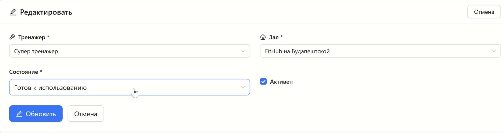
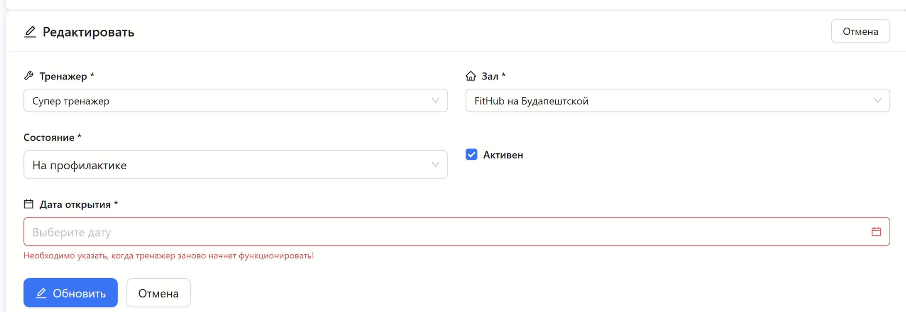
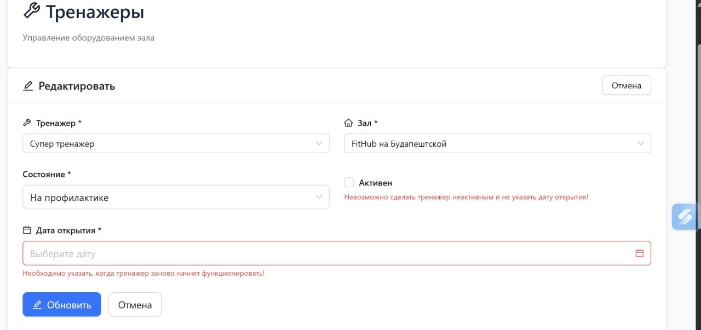
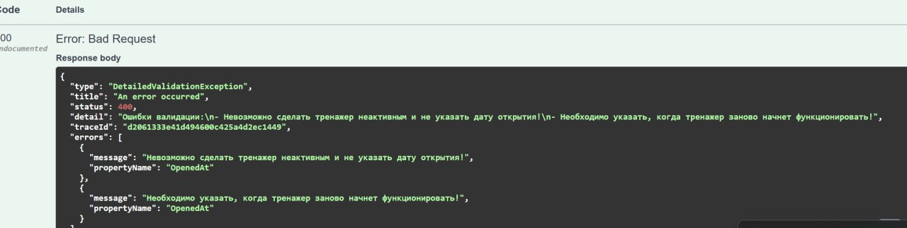
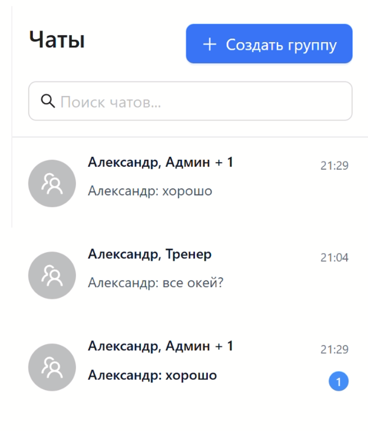
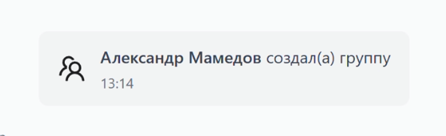
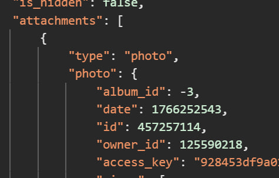
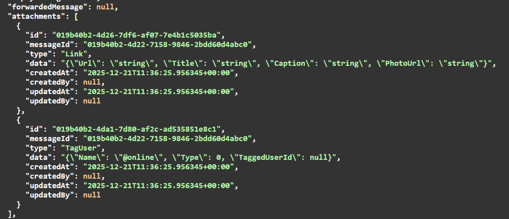

# FitHub

Демонстрационный проект: вертикальная SaaS-платформа для фитнес-индустрии в виде монолита
- Прототип системы, который объединяет логику ERP (управление ресурсами компании и конкретных залов) и CRM (работа с посетителями)
- Полигон (sandbox) для проверки гипотез и предположений насчет конкретных технологий

## Содержание

- [Стек](#Tech-stack)
- [Дальнейшие планы](#дальнейшие-планы)
- [Демонстрация работы](#демонстрация-работы)
- [Достойно отдельного упоминания](#достойно-отдельного-упоминания)
    - [Валидация форм]
    - [Read Model денормализация для производительности]
    - [JSONB для динамических данных, и как это связано с BDUI]
    - [SignalR для real-time чата и не только]


## Tech stack
- Монолит (пока что)
- Clean Architecture (Presentation, Infrastucture, Core)
- в домене прослеживается DDD (Value Objects ids; инварианты внутри Entity, а не размазаны по сервисам)
- .NET 9
    - Nullable reference types
    - Central package management
- ASP.NET Core with SignalR (WebSockets)
    - JWT Authentication (для апи ручек и SignalR)
    - Policy based Authorization на основе JWT Claimы
- EF Core 9
    - либа: базовые репозитории, UnitOfWork, конвеншны (enum as string, ValueType Identifiers, Interceptors для аудитабл полей и тд)
    - PostgreSQL: реляционная модель, индексы, jsonb, read-models денормализация для perfomance
- RabbitMQ (🌱 на будущее)
    - Базовая библиотека production-readiness: producer, consumer, DLQ, routing
- Minio S3
    - upload via presigned urls
    - отказоустойчивый upload flow для фотографий благодаря компенсирующей cleanup job (запись в бд не остается без файла в s3, файл в s3 не остается без записи в бд)
- Unit And Integration Testing
    - xUnit, Moq, Autofixture
    - TestContainers
    - WebApplicationFactory с подменой части IServiceCollection (auth и внешние апи клиенты)
- React
    - TypeScipt, Vite
    - React Hook Form
    - Ant Design, Tailwind
    - Redux with Redux Toolkit

## Дальнейшие планы
- IdentityServer with SSO (KeyCloak)
    - OAuth, OIDC
- OpenTelemetry for Ditributed logs and traces
- GRPC
- BDUI
- Геопозиционирование
    - точки, полигоны на карте
- Полноценная система доставки: delivery, orders, warehouse
    - Логистические вопросы: поиск наилучших путей, оптимизация работы курьеров
    - Антифрод, подозрительная активность


## Демонстрация работы

<!-- 
 -->

## Достойно отдельного упоминания

### Динамическая связка правил форм: FluentValidation + автоматический маппинг в ProblemDetails через Error Handler. На фронтенде React Hook Form с автоматическим парсингом ответа

Пример:
Форма:

Кейс 1 валидации:

Кейс 2 валидации:

Ответ от бэкенда:


Функция на фронтенде, которая автоматически маппит ответ бэкенда в RHF:
```typescript
/**
 * Маппит серверные ошибки валидации на поля формы react-hook-form
 * @param errors - массив ошибок с бэкенда
 * @param setError - функция setError из useForm
 */
export function mapServerValidationErrors<T extends FieldValues>(
  errors: ValidationError[] | undefined,
  setError: UseFormSetError<T>
): void {
  if (!errors || errors.length === 0) return;

  const mapPropertyToField = (propertyName: string): string => {
    if (!propertyName) return propertyName;
    return propertyName.charAt(0).toLowerCase() + propertyName.slice(1);
  };

  for (const err of errors) {
    const field = mapPropertyToField(err.propertyName);
    if (!field) continue;
    
    setError(field as unknown, { 
      type: "server", 
      message: err.message 
    });
  }
}
```

Поле дата открытия зависит от полей "Состояние" и "Активен" и должно быть заполнено, если транажер неактивен или не находится в состоянии "Готов к использованию"

### Read Model денормалидация

Необходимо реализовать боковую панель с чатами



В обычной реляционной модели это будет тяжелый запрос для бд (тк будет множество join с группировками, order by и тд)

Поэтому внедряем read-model

```sql
CREATE TABLE public.chat_reading_model (
	id uuid NOT NULL,
	chat_id uuid NOT NULL,
	user_id uuid NOT NULL,
	last_message_id uuid NOT NULL,
	last_message_text text NOT NULL,
	last_message_time timestamptz NOT NULL,
	first_message_time timestamptz NOT NULL,
	unread_count int4 NOT NULL,
	created_at timestamptz NOT NULL,
	updated_at timestamptz NOT NULL,
	CONSTRAINT pk_chat_reading_model PRIMARY KEY (id)
);
```

Подход ходовой, часто используется в индустрии. Позволяет совместить мощь реляционной бд (ACID) и денормализации, и получить лучшее из миров sql и nosql

### JSONB вместо реляционной модели для динамических полей

Кейс: нужно внедрить множество вложений к сообщениям

Пример:


В вк море таких вложений: создание группы, вложение с файлов, приглашение в группу, скидывание поста и тд

Используют подход с типом вложения + его метаданными в json


В .NET можно реализовать такой же json, но проще использовать json внутри строки, как мне кажется



#### Плюсы:
- легко хранить на бэкенде
- улучшенная производительно из-за отсутствия join (похоже на read-model)
- легко добавлять новые типы вложений
#### Минусы:
- для большинства типов вложений придется инвалидировать содержимое (собственно как и для read-model и для любого кэша)

Далее фронтенд парсит этот attachment и решает какой компонент будет рендерить его и каким образом. Базовый компонент, который регает, кто будет рендерить:
```tsx
export const CustomMessageAttachment: React.FC<CustomMessageAttachmentProps> = ({ message }) => {
  // Берем первый attachment (системное сообщение имеет только один всегда)
  const attachment = message.attachments[0];

  if (!attachment) {
    return null;
  }

  // Роутинг на конкретный компонент в зависимости от типа
  switch (attachment.type) {
    case MessageAttachmentType.CreateGroup:
      return <CreateGroupAttachment message={message} attachment={attachment} />;
    
    // case MessageAttachmentType.InviteUser:
    //   return <AddUserAttachment message={message} attachment={attachment} />;

    default:
      return (
        <div className="text-center py-2 px-4 bg-gray-100 rounded text-sm text-gray-600">
          Не поддерживается вашей версией
        </div>
      );
  }
};
```

Конкретный компонент конкретного attachment:
```tsx
interface CreateGroupAttachmentProps {
  message: IMessageResponse;
  attachment: IMessageAttachmentResponse;
}

export const CreateGroupAttachment: React.FC<CreateGroupAttachmentProps> = ({ 
  message,
  attachment 
}) => {
  const data = JSON.parse(attachment.data || '{}');
  const groupName = data.groupName || '';

  return (
    <SystemMessageBase 
      message={message}
      icon={<TeamOutlined className="text-2xl text-blue-500" />}
    >
      <span className="font-semibold">{getFullName(message.createdBy)}</span>
      {' '}создал(а) группу {groupName}
    </SystemMessageBase>
  );
};
```

Это конечно еще не BDUI, но впринцип очень похож: приходит динамический JSON на базе которого рендериться компонент в каком-то месте экрана. Только на всякидку раз в 5-7 больше человеко-часов чтобы реализовать BDUI с нуля

### SignalR

Real-Time взаимодействие в чате с помощью WebSockets
Использовать можно не только для чата, но и для любого real-time взаимодействия: изменение цены на странице товара, назначение курьера на странице отслеживания доставки и тд... примеров множество

```
public interface IChatHub
{
    Task CreateMessage(MessageResponse messageResponse);
    Task UpdateMessage(MessageResponse messageResponse);
    Task MessageDeleted(string chatId, string messageId);

    Task UserTyping(string userId, string userName, string chatId);
    Task UserStopTyping(string userId, string userName, string chatId);

    Task UserOnline(string userId);
    Task UserOffline(string userId, DateTimeOffset endOnlineAt);
}
```

```
[Authorize]
public class ChatHub : Hub<IChatHub>
{
    private readonly ILogger<ChatHub> logger;
    private readonly IChatService chatService;
    private readonly IUserService userService;

    public ChatHub(ILogger<ChatHub> logger, IChatService chatService, IUserService userService)
    {
        this.logger = logger;
        this.chatService = chatService;
        this.userService = userService;
    }

    public override async Task OnConnectedAsync()
    {
        // логика по добавлению в группы

        await base.OnConnectedAsync();
    }

    public override async Task OnDisconnectedAsync(Exception? exception)
    {
        // логика по выставлению офлайна

        await base.OnDisconnectedAsync(exception);
    }

    public async Task NotifyTyping(string chatId)
    {
        var userId = Context.User?.GetUserId();
        var userName = Context.User?.GetUsername();
        await Clients.OthersInGroup(chatId.GetChatGroupName()).UserTyping(userId.Required(), userName.Required(), chatId);
    }

    public async Task NotifyStopTyping(string chatId)
    {
        var userId = Context.User?.GetUserId();
        var userName = Context.User?.GetUsername();
        await Clients.OthersInGroup(chatId.GetChatGroupName()).UserStopTyping(userId.Required(), userName.Required(), chatId);
    }

    public async Task JoinChat(string chatId)
    {
        await Groups.AddToGroupAsync(Context.ConnectionId, chatId.GetChatGroupName());
    }

    public async Task Heartbeat()
    {
        var userId = Context.User.Required().GetParsedUserId();

        await userService.StartOnlineAt(userId, Context.ConnectionAborted);

        await Task.Delay(100);
    }
}
```

Тестирование через Postman:


На фронтенде на все время жизни приложение используется лишь одно соединение с этим хабом для того, чтобы не поднимать множество соединений
Через этот хаб будут проходить сообщения и уведомления, тк они нужны все время нахождения пользователя в приложение

```
interface SignalRContextType {
  connection: HubConnection | null;
  notifyTyping: (chatId: string) => Promise<void>;
  notifyStopTyping: (chatId: string) => Promise<void>;
}

const WebSocketContext = createContext<SignalRContextType | null>(null);


export const WebSocketProvider : FC<{ children: ReactNode }> = ({ children }) => {
    const dispatch = useAppDispatch();
    const [connection, setConnection] = useState<HubConnection | null>(null);
    const {user} = useAuth();

    useEffect(() => {
        const conn = new HubConnectionBuilder()
            .withUrl(`${API_URL_CLEAN}/chatHub`)
            .withAutomaticReconnect()
            .build();

        conn.on('UserTyping', (userId: string, userName: string, chatId: string) => {
          console.log(`from signalR: UserTyping user: ${userName} chat: ${chatId}`)
          dispatch(setUserTyping({
            chatId: chatId,
            userId: userId,
            userName: userName,
            isTyping: true
          }));
        })

        conn.on('UserStopTyping', (userId: string, userName: string, chatId: string) => {
          console.log(`from signalR: UserStopTyping user: ${userName} chat: ${chatId}`)
          dispatch(setUserTyping({
            chatId: chatId,
            userId: userId,
            userName: userName,
            isTyping: false
          }));
        })

        conn.on('CreateMessage', (message: IMessageResponse) => {
          dispatch(addMessage({
            chatId: message.chatId,
            message: message
          }));
          dispatch(
            updateLastMessage({
              chatId: message.chatId,
              lastMessage: message,
              lastMessageTime: message.createdAt,
              needIncrement: message.createdBy.id !== user?.id
            })
          );
          
        })

        conn.on('UpdateMessage', (message: IMessageResponse) => {
          dispatch(updateMessage({
            chatId: message.chatId,
            messageId: message.id,
            updates: message
          }));
        })

        conn.on('MessageDeleted', (chatId: string, messageId: string) => {
          dispatch(deleteMessage({
            chatId,
            messageId
          }))
        })

        conn.onreconnecting(() => {
          dispatch(setConnectionState(ConnectionState.RECONNECTING));
        });

        conn.onreconnected(() => {
          dispatch(setConnectionState(ConnectionState.CONNECTED));
        });

        conn.start().then(() => {
          setConnection(conn);
        });

        return () => {
          console.log('Cleaning up SignalR connection');
          
          // Удаляем все обработчики
          conn.off('UserTyping');
          conn.off('UserStopTyping');
          conn.off('CreateMessage');
          conn.off('UpdateMessage');
          conn.off('MessageDeleted');
        };
    }, [dispatch]);

    
    const notifyTyping = async (chatId: string) => {
      if (!connection || connection.state !== HubConnectionState.Connected) {
        console.warn('SignalR not connected, skipping notifyTyping');
        return; // Просто выходим без ошибки
      }
      
      try {
        await connection.invoke('NotifyTyping', chatId);
      } catch (error) {
        console.error('Failed to notify typing:', error);
      }
    };

    const notifyStopTyping = async (chatId: string) => {
      if (!connection || connection.state !== HubConnectionState.Connected) {
        console.warn('SignalR not connected, skipping notifyStopTyping');
        return;
      }
      
      try {
        await connection.invoke('NotifyStopTyping', chatId);
      } catch (error) {
        console.error('Failed to notify stop typing:', error);
      }
    };


    return (
      <WebSocketContext.Provider value={{ connection, notifyTyping, notifyStopTyping }}>
        {children}
      </WebSocketContext.Provider>
    );
}


export const useSignalR = () => {
  const context = useContext(WebSocketContext);
  if (!context) throw new Error('useSignalR must be used within SignalRProvider');
  return context;
};
```