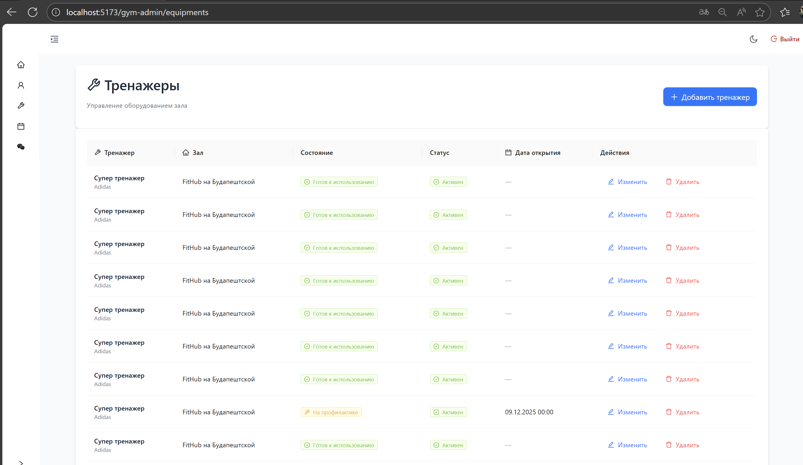
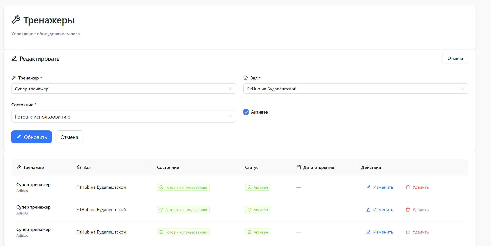
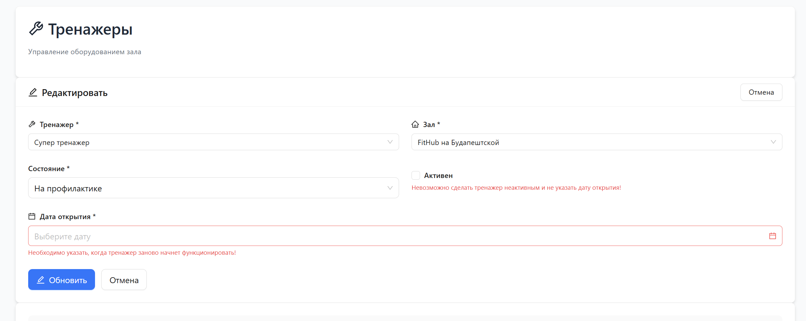
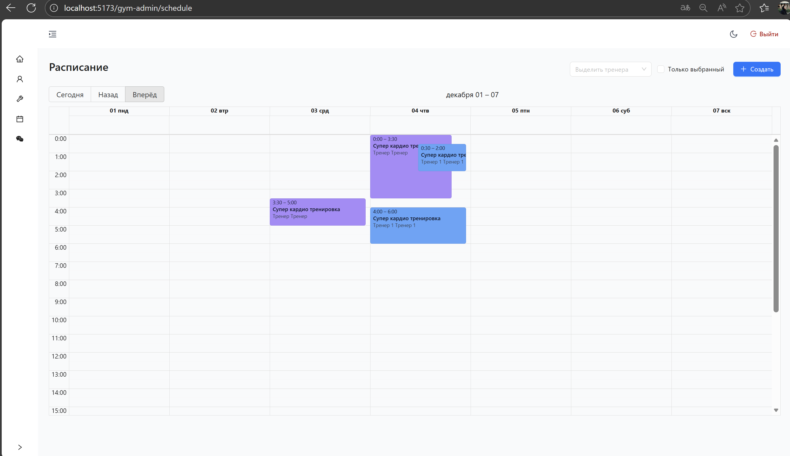
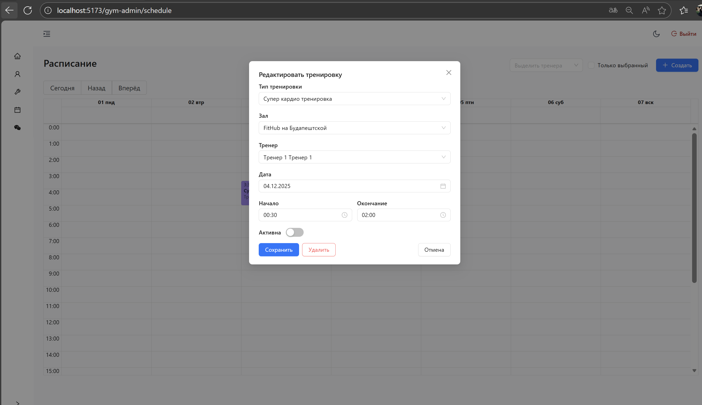
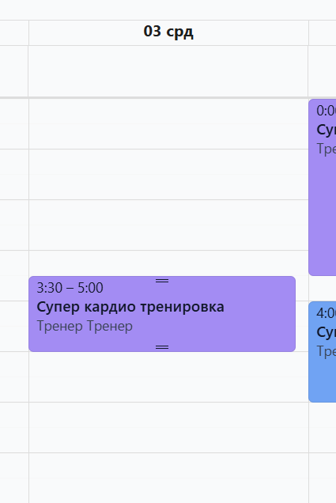
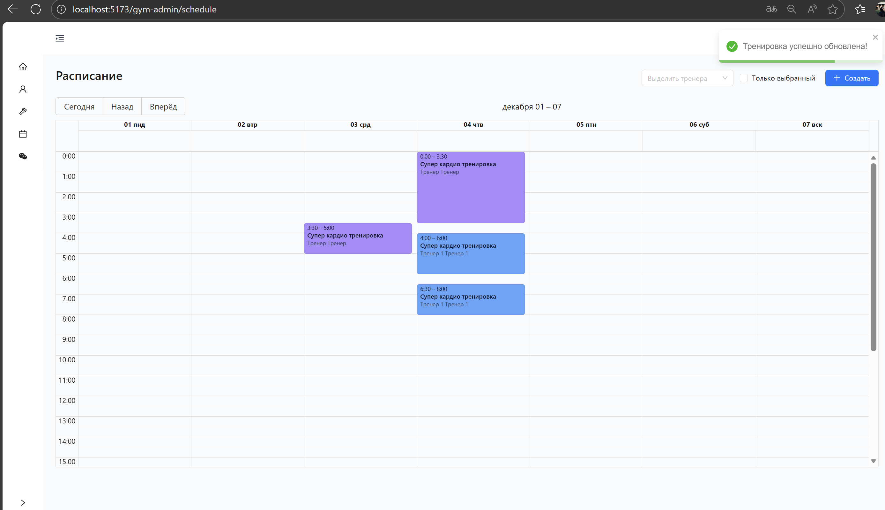
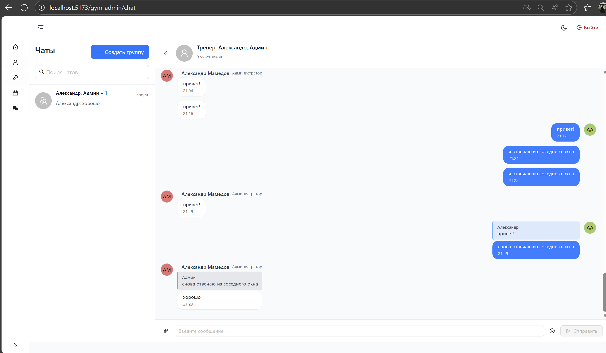

# Модуль администратора зала

Демонстракция работы

1. Страница с тренажерами

Основной грид:

Редактирование тренажера:

Ошибки в форме:

2. Модуль расписания тренировок

Календарь:

Редактирование тренировки:

Растягивание продолжительности тренировки:

DnD для переноса тренировки:

3. Чат аналогичен

