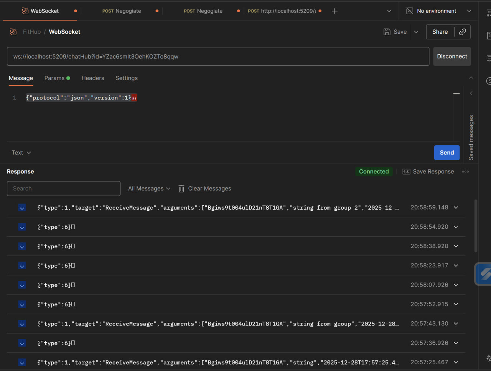

# SignalR


Real-Time взаимодействие в чате с помощью WebSockets
Использовать можно не только для чата, но и для любого real-time взаимодействия: изменение цены на странице товара, назначение курьера на странице отслеживания доставки и тд... примеров множество

```
public interface IChatHub
{
    Task CreateMessage(MessageResponse messageResponse);
    Task UpdateMessage(MessageResponse messageResponse);
    Task MessageDeleted(string chatId, string messageId);

    Task UserTyping(string userId, string userName, string chatId);
    Task UserStopTyping(string userId, string userName, string chatId);

    Task UserOnline(string userId);
    Task UserOffline(string userId, DateTimeOffset endOnlineAt);
}
```

```
[Authorize]
public class ChatHub : Hub<IChatHub>
{
    private readonly ILogger<ChatHub> logger;
    private readonly IChatService chatService;
    private readonly IUserService userService;

    public ChatHub(ILogger<ChatHub> logger, IChatService chatService, IUserService userService)
    {
        this.logger = logger;
        this.chatService = chatService;
        this.userService = userService;
    }

    public override async Task OnConnectedAsync()
    {
        // логика по добавлению в группы

        await base.OnConnectedAsync();
    }

    public override async Task OnDisconnectedAsync(Exception? exception)
    {
        // логика по выставлению офлайна

        await base.OnDisconnectedAsync(exception);
    }

    public async Task NotifyTyping(string chatId)
    {
        var userId = Context.User?.GetUserId();
        var userName = Context.User?.GetUsername();
        await Clients.OthersInGroup(chatId.GetChatGroupName()).UserTyping(userId.Required(), userName.Required(), chatId);
    }

    public async Task NotifyStopTyping(string chatId)
    {
        var userId = Context.User?.GetUserId();
        var userName = Context.User?.GetUsername();
        await Clients.OthersInGroup(chatId.GetChatGroupName()).UserStopTyping(userId.Required(), userName.Required(), chatId);
    }

    public async Task JoinChat(string chatId)
    {
        await Groups.AddToGroupAsync(Context.ConnectionId, chatId.GetChatGroupName());
    }

    public async Task Heartbeat()
    {
        var userId = Context.User.Required().GetParsedUserId();

        await userService.StartOnlineAt(userId, Context.ConnectionAborted);

        await Task.Delay(100);
    }
}
```

Тестирование через Postman:



На фронтенде на все время жизни приложение используется лишь одно соединение с этим хабом для того, чтобы не поднимать множество соединений
Через этот хаб будут проходить сообщения и уведомления, тк они нужны все время нахождения пользователя в приложение

```
interface SignalRContextType {
  connection: HubConnection | null;
  notifyTyping: (chatId: string) => Promise<void>;
  notifyStopTyping: (chatId: string) => Promise<void>;
}

const WebSocketContext = createContext<SignalRContextType | null>(null);


export const WebSocketProvider : FC<{ children: ReactNode }> = ({ children }) => {
    const dispatch = useAppDispatch();
    const [connection, setConnection] = useState<HubConnection | null>(null);
    const {user} = useAuth();

    useEffect(() => {
        const conn = new HubConnectionBuilder()
            .withUrl(`${API_URL_CLEAN}/chatHub`)
            .withAutomaticReconnect()
            .build();

        conn.on('UserTyping', (userId: string, userName: string, chatId: string) => {
          console.log(`from signalR: UserTyping user: ${userName} chat: ${chatId}`)
          dispatch(setUserTyping({
            chatId: chatId,
            userId: userId,
            userName: userName,
            isTyping: true
          }));
        })

        conn.on('UserStopTyping', (userId: string, userName: string, chatId: string) => {
          console.log(`from signalR: UserStopTyping user: ${userName} chat: ${chatId}`)
          dispatch(setUserTyping({
            chatId: chatId,
            userId: userId,
            userName: userName,
            isTyping: false
          }));
        })

        conn.on('CreateMessage', (message: IMessageResponse) => {
          dispatch(addMessage({
            chatId: message.chatId,
            message: message
          }));
          dispatch(
            updateLastMessage({
              chatId: message.chatId,
              lastMessage: message,
              lastMessageTime: message.createdAt,
              needIncrement: message.createdBy.id !== user?.id
            })
          );
          
        })

        conn.on('UpdateMessage', (message: IMessageResponse) => {
          dispatch(updateMessage({
            chatId: message.chatId,
            messageId: message.id,
            updates: message
          }));
        })

        conn.on('MessageDeleted', (chatId: string, messageId: string) => {
          dispatch(deleteMessage({
            chatId,
            messageId
          }))
        })

        conn.onreconnecting(() => {
          dispatch(setConnectionState(ConnectionState.RECONNECTING));
        });

        conn.onreconnected(() => {
          dispatch(setConnectionState(ConnectionState.CONNECTED));
        });

        conn.start().then(() => {
          setConnection(conn);
        });

        return () => {
          console.log('Cleaning up SignalR connection');
          
          // Удаляем все обработчики
          conn.off('UserTyping');
          conn.off('UserStopTyping');
          conn.off('CreateMessage');
          conn.off('UpdateMessage');
          conn.off('MessageDeleted');
        };
    }, [dispatch]);

    
    const notifyTyping = async (chatId: string) => {
      if (!connection || connection.state !== HubConnectionState.Connected) {
        console.warn('SignalR not connected, skipping notifyTyping');
        return; // Просто выходим без ошибки
      }
      
      try {
        await connection.invoke('NotifyTyping', chatId);
      } catch (error) {
        console.error('Failed to notify typing:', error);
      }
    };

    const notifyStopTyping = async (chatId: string) => {
      if (!connection || connection.state !== HubConnectionState.Connected) {
        console.warn('SignalR not connected, skipping notifyStopTyping');
        return;
      }
      
      try {
        await connection.invoke('NotifyStopTyping', chatId);
      } catch (error) {
        console.error('Failed to notify stop typing:', error);
      }
    };


    return (
      <WebSocketContext.Provider value={{ connection, notifyTyping, notifyStopTyping }}>
        {children}
      </WebSocketContext.Provider>
    );
}


export const useSignalR = () => {
  const context = useContext(WebSocketContext);
  if (!context) throw new Error('useSignalR must be used within SignalRProvider');
  return context;
};
```