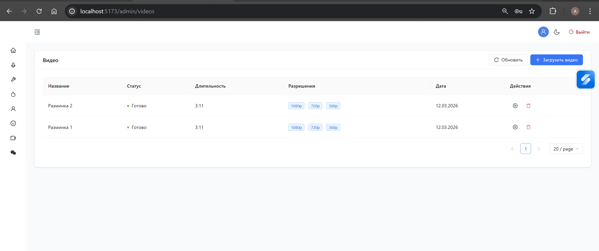
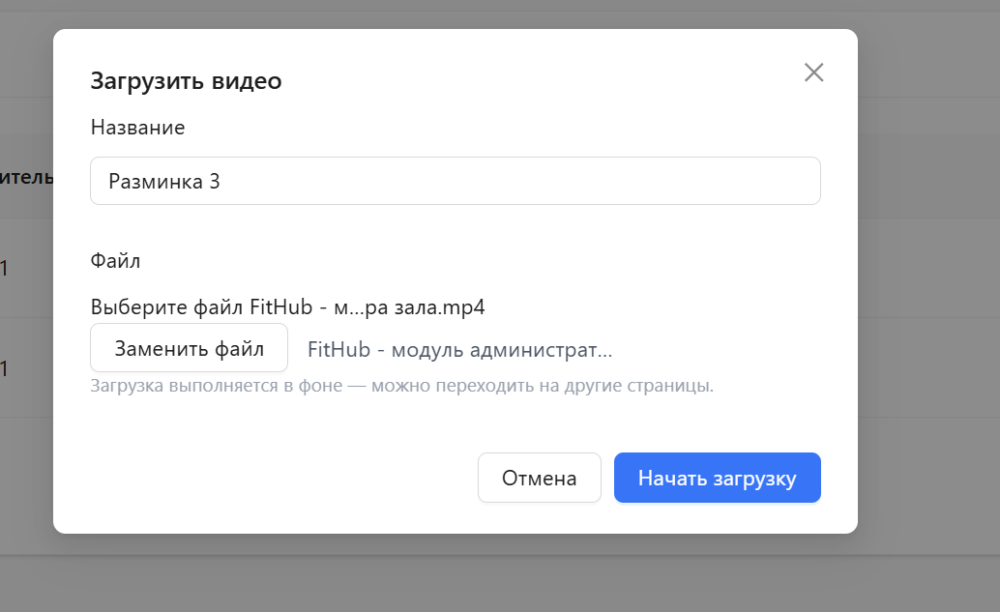
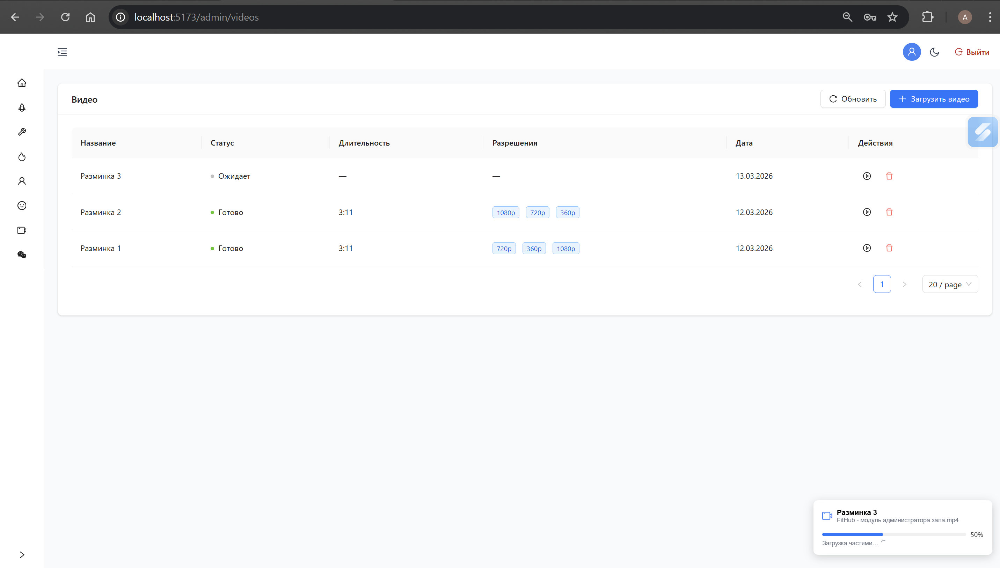
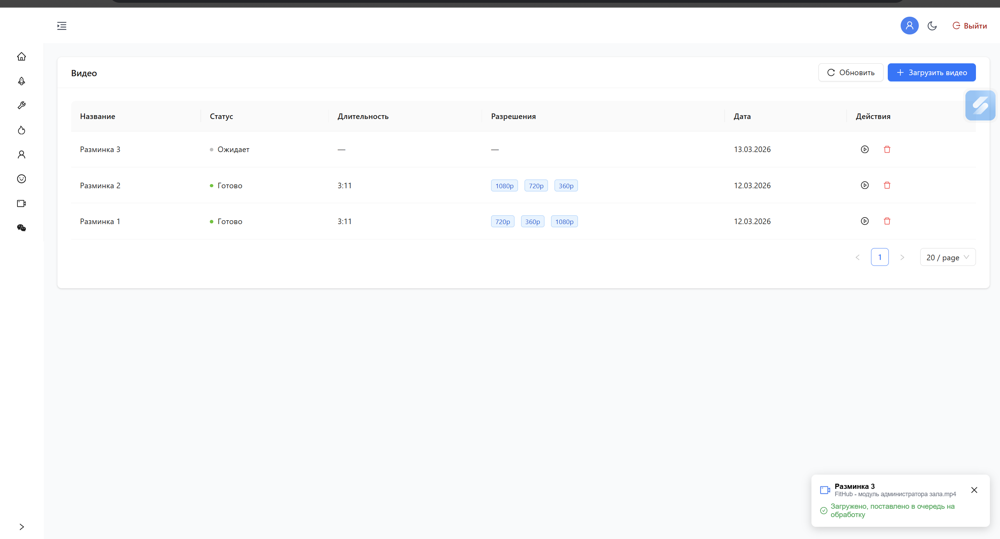
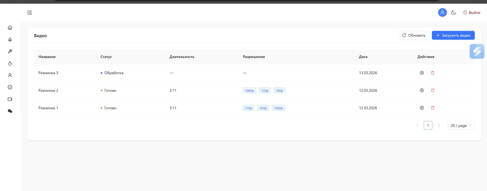
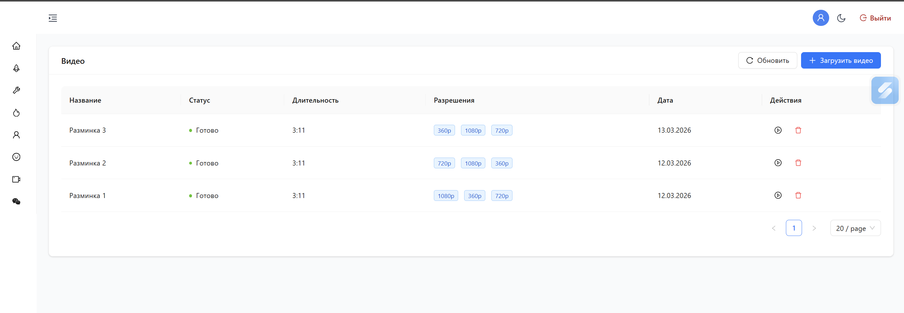
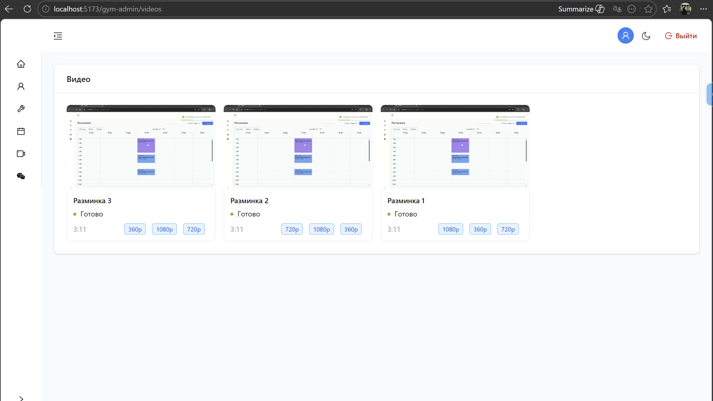
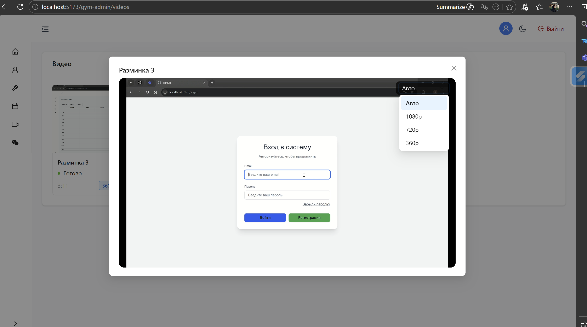

# Загрузка и обработка видео

Полное описание того, как видео загружается, кодируется и воспроизводится в FitHub.

---

## Обзор архитектуры

```
Frontend                     Backend (Host)          RabbitMQ        Backend (HostJobs)
   │                               │                     │                    │
   │── POST init-multipart-upload ─>│                    │                    │
   │<── { videoId, parts[] } ──────│                     │                    │
   │                               │                     │                    │
   │── PUT chunk 1 ─────────────────────────> [Minio]    │                    │
   │── PUT chunk 2 ─────────────────────────> [Minio]    │                    │  (3 чанка параллельно)
   │── PUT chunk 3 ─────────────────────────> [Minio]    │                    │
   │                               │                     │                    │
   │── POST complete-multipart ────>│                    │                    │
   │<── 202 Accepted ──────────────│                    │                    │
   │                               │─── enqueue ────────>│                    │
   │                               │                     │──> VideoEncoding   │
   │                               │                     │    Consumer ──────>│
   │                               │<── POST /process ────────────────────────│
   │                               │                     │                    │
   │                               │  [FFmpeg: лучшее    │                    │
   │                               │   качество первым]  │                    │
   │                               │  → status: Ready    │                    │
   │                               │  [FFmpeg: остальные │                    │
   │                               │   профили]          │                    │
   │                               │                     │                    │
   │  (опрос каждые 8с)            │                     │                    │
   │── GET /videos ───────────────>│                     │                    │
   │<── status: Ready ─────────────│                     │                    │
   │                               │                     │                    │
   │── GET /resolutions ──────────>│                     │                    │
   │<── [{ url, quality }] ────────│                     │                    │
   │                               │                     │                    │
   │  [VideoPlayer играет]         │                     │                    │
```

---

## Шаг 1 — Инициализация multipart-загрузки




**Frontend** (`VideoUploadContext.startUpload`) вызывает `POST /api/v1/videos/init-multipart-upload`:

```json
{ "title": "Тренировка ног", "fileExtension": "mp4", "fileSizeBytes": 104857600 }
```

**Backend** (`VideoService.InitMultipartUploadAsync`):
1. Создаёт запись `FileEntity` в БД со статусом `WaitingUpload`
2. Создаёт запись `Video` в БД со статусом `Pending`, связанную с файлом
3. Формирует S3-ключ: `videos/{videoId}/original.{ext}`
4. Открывает multipart-сессию в Minio
5. Генерирует presigned PUT URL для каждого чанка по 10 МБ: `⌈fileSizeBytes / 10MB⌉` частей
6. Возвращает:

```json
{
  "videoId": "video_...",
  "parts": [
    { "partNumber": 1, "url": "http://minio:9000/files/...?partNumber=1&uploadId=..." },
    { "partNumber": 2, "url": "http://minio:9000/files/...?partNumber=2&uploadId=..." }
  ]
}
```

---

## Шаг 2 — Параллельная загрузка чанков в S3




**Frontend** (`VideoUploadContext`) разбивает файл на чанки по 10 МБ и загружает до **3 частей параллельно** напрямую в Minio — бэкенд не участвует:

```ts
// CHUNK_SIZE = 10 * 1024 * 1024
// CONCURRENCY = 3
uploadPart: (url: string, chunk: Blob) =>
    axios.put(url, chunk, { headers: { 'Content-Type': 'application/octet-stream' } })
```

Из заголовка ответа каждого PUT-запроса извлекается `ETag` — он потребуется для подтверждения загрузки.

Прогресс загрузки (0–90%) отображается в плавающем компоненте `VideoUploadProgress` (правый нижний угол).

---

## Шаг 3 — Завершение multipart-загрузки

**Frontend** вызывает `POST /api/v1/videos/{id}/complete-multipart` с собранными ETags:

```json
{
  "parts": [
    { "partNumber": 1, "eTag": "\"abc123...\"" },
    { "partNumber": 2, "eTag": "\"def456...\"" }
  ]
}
```

**Backend** (`VideoService.CompleteMultipartUploadAsync`):
1. Загружает `Video` (статус должен быть `Pending`)
2. Завершает multipart-сессию в Minio (Minio собирает чанки в один файл)
3. Помечает `FileEntity` как `Active` и связывает с `Video`
4. Публикует `VideoEncodingMessage` в RabbitMQ:
   - Exchange: `video.encoding` (direct)
   - Routing key: `video.encoding.process`
   - Payload: `{ "videoId": "video_..." }`
5. Возвращает `202 Accepted

---

## Шаг 4 — Асинхронное кодирование (HostJobs)




`HostJobs` — отдельный Worker Service, который потребляет сообщения из RabbitMQ.

**`VideoEncodingConsumer`** (очередь `video.encoding.queue`) получает сообщение и вызывает `VideoClient.ProcessAsync(videoId)`, который делает HTTP POST на `Host` по адресу `/api/v1/videos/{id}/process`. HTTP-таймаут для этого запроса отключён — кодирование может занять произвольное время.

**Backend** (`VideoService.ProcessAsync`):

1. Помечает видео как `Processing`
2. Скачивает оригинальный файл из S3 во временную директорию:
   `%TEMP%/fithub_videos/{videoId}/original.{ext}`
3. Запускает `FFProbe.AnalyseAsync` — получает длительность и исходное разрешение
4. Определяет подходящие профили кодирования (только те, чья высота ≤ исходной)
5. **Сначала кодирует лучший профиль** (наибольшее подходящее разрешение) → сразу помечает видео как `Ready` и сохраняет постер

| Качество | Разрешение  | CRF | Preset  | Аудио    | Битрейт       |
|----------|-------------|-----|---------|----------|---------------|
| 360p     | 640×360     | 28  | faster  | 96 кбит  | 500 кбит/с    |
| 720p     | 1280×720    | 23  | faster  | 128 кбит | 2500 кбит/с   |
| 1080p    | 1920×1080   | 20  | medium  | 192 кбит | 5000 кбит/с   |

Каждое разрешение использует фильтр `scale+pad` — соотношение сторон сохраняется без обрезки.

6. Генерирует постер (JPEG на середине видео; для коротких — на 1 секунде)
7. Кодирует оставшиеся профили — ошибка в одном профиле не сбрасывает статус `Ready`
8. Загружает закодированные файлы в S3: `videos/{videoId}/360p.mp4`, `720p.mp4`, `1080p.mp4`
9. Сохраняет запись `VideoResolution` на каждое качество в БД
10. Удаляет временную директорию

При критической ошибке (до первого `Ready`): помечает видео как `Failed` с текстом исключения; временные файлы удаляются в `finally`.

---

## Шаг 5 — Воспроизведение




**Frontend** опрашивает `GET /api/v1/videos` каждые 8 секунд, пока хотя бы одно видео находится в статусе `Pending` или `Processing`.

Как только `status === 'Ready'`, пользователь может нажать Play. Плеер запрашивает:

```
GET /api/v1/videos/{id}/resolutions
```

Возвращает presigned **GET URL** для каждого закодированного файла. URL кешируются в БД на **7 дней** и автоматически обновляются, когда до истечения остаётся менее **1 дня**:

```json
{
  "items": [
    { "quality": "Q360P",  "qualityLabel": 360,  "widthPx": 640,  "heightPx": 360,  "bitrateKbps": 500,  "url": "http://..." },
    { "quality": "Q720P",  "qualityLabel": 720,  "widthPx": 1280, "heightPx": 720,  "bitrateKbps": 2500, "url": "http://..." },
    { "quality": "Q1080P", "qualityLabel": 1080, "widthPx": 1920, "heightPx": 1080, "bitrateKbps": 5000, "url": "http://..." }
  ]
}
```

> Если видео ещё не `Ready`, эндпоинт возвращает presigned URL оригинального файла (`quality: "Original"`).

**Компонент `VideoPlayer`** реализует адаптивный выбор качества:
- При загрузке измеряет пропускную способность: скачивает тестовый чанк 200 КБ и замеряет скорость
- Выбирает начальное качество: `≥ 4 Мбит/с → 1080p`, `≥ 1.5 Мбит/с → 720p`, иначе `360p`
- Каждые 4 секунды проверяет буфер:
  - Буфер > 15 с и качество не максимальное → повышает качество
  - Буфер < 3 с и качество не минимальное → понижает качество
- Переключение качества сохраняет позицию воспроизведения и состояние паузы
- Ручной выбор качества через выпадающий список (отображается при наведении)

---

## Структура ключей в S3

```
files/                         ← бакет
└── videos/
    └── {videoId}/
        ├── original.{ext}     ← исходный загруженный файл (сохраняется после кодирования)
        ├── poster.jpg         ← сгенерированный постер (кадр с середины видео)
        ├── 360p.mp4
        ├── 720p.mp4
        └── 1080p.mp4
```

---

## Жизненный цикл статуса видео

```
Pending ──► Processing ──► Ready
   │               │
   │               └───────────────────► Failed
   └───────────────────────────────────► Failed
```

| Статус       | Когда устанавливается                                                  |
|--------------|------------------------------------------------------------------------|
| `Pending`    | При `InitMultipartUpload` — видео создано в БД                         |
| `Processing` | При старте `ProcessAsync` — скачивание и кодирование начались          |
| `Ready`      | После кодирования лучшего профиля — видео уже доступно для просмотра  |
| `Failed`     | При исключении до первого успешного профиля                            |

---

## Схема базы данных

```
video
├── id                UUID PK
├── title             text
├── original_file_id  UUID FK → file_entity(id)  ON DELETE RESTRICT
├── status            text  (Pending | Processing | Ready | Failed)
├── duration_seconds  int?
├── poster_s3_key     text?
├── poster_cached_url text?
├── poster_url_expires_at  timestamptz?
├── original_cached_url    text?
├── original_url_expires_at timestamptz?
├── failure_reason    text?
└── created_at        timestamptz

video_resolution
├── id              UUID PK
├── video_id        UUID FK → video(id)  ON DELETE CASCADE
├── quality         text  (Q360P | Q720P | Q1080P)
├── s3_key          text
├── file_size_bytes bigint
├── width_px        int
├── height_px       int
├── bitrate_kbps    int
├── cached_url      text?
└── url_expires_at  timestamptz?
```