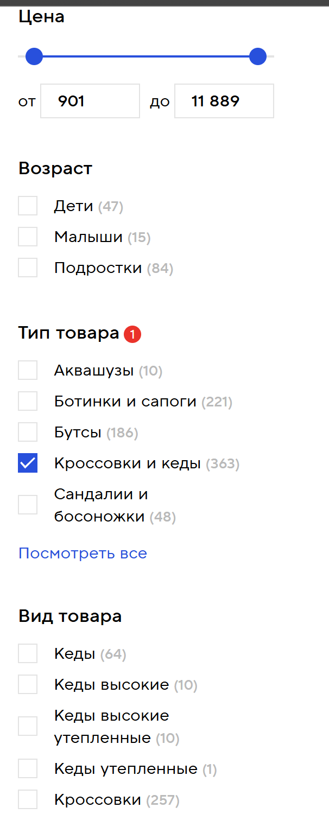

# Dynamic Attributes & Faceted Search в E-commerce

## Проблема

Товары разных категорий имеют **разные характеристики**:
- **Обувь**: размер стельки (25-30см), тип застежки (шнурки/липучки)
- **Одежда**: наличие капюшона (true/false), длина рукава (короткий/длинный)  
- **Электроника**: диагональ экрана (32-85"), разрешение (FullHD/4K)


🎯 Бизнес-польза (ROI)

1. Добавление фильтров без разработчиков ⭐ ЗОЛОТОЙ ПЛЮС

```
СХЕМА: Менеджер категории → Admin UI → "Добавить фильтр: Длина рукава (range 50-90см)"
РЕЗУЛЬТАТ: 5 минут → новый фильтр на сайте для 100k товаров

ТРАДИЦИОННЫЙ подход: 
→ Task в Jira → разработчик → миграция → тест → деплой → 2 недели
```

2. A/B тестирование фильтров

```
Вариант A: показать "Эко-товар" toggle
Вариант B: показать "С капюшоном" checkbox
→ Автоматически считаем конверсию
```

3. SEO: уникальные страницы фильтров

```
одежда/куртки/капюшон=true/цена=5-20к/
→ 100+ страниц с реальным трафиком из Google
```


**Требования:**
1. ✅ **Динамические фильтры** — UI подстраивается под категорию
2. ✅ **Фасеты** — показывать только релевантные варианты с count
3. ✅ **Типизация** — .NET + TypeScript без `any`
4. ✅ **Производительность** — <50ms на 1M+ товаров
5. ✅ **Масштабируемость** — добавление новых атрибутов без миграций и участия разрабтки

## Цель

```
1. Backend-Driven UI: бэк отдает схему фильтров → фронт рендерит
2. Гибридная архитектура: статические (колонки) + динамические (JSONB)  
3. Фасеты обновляются после каждого фильтра
4. Typed Request/Response через discriminated unions + NSwag
```

## Схема БД (финальная)

```sql
-- 1. Категории (дерево Adjacency List)
CREATE TABLE Categories (
    Id UUID PRIMARY KEY,
    Name NVARCHAR(255),
    ParentId UUID REFERENCES Categories(Id)
);

-- 2. Товары (статические + динамические атрибуты)
CREATE TABLE Products (
    Id UUID PRIMARY KEY,
    Name NVARCHAR(255),
    Price DECIMAL(10,2),                    -- Статический
    Attributes JSONB,                       -- Динамические
    INDEX idx_price (Price),
    INDEX idx_attributes ON Products USING GIN(Attributes)
);

-- 3. M:N связи категорий
CREATE TABLE ProductCategory (
    ProductId UUID REFERENCES Products(Id),
    CategoryId UUID REFERENCES Categories(Id),
    PRIMARY KEY (ProductId, CategoryId)
);
```

## Фасеты с фильтрацией после выбора в другой категории

**Фасеты = доступные значения с count для текущей выборки**




```
1. Выбрал "Куртки" → показаны фасеты: "капюшон", "длина рукава"
2. Выбрал "С капюшоном" → в "размере" пропали XS/XXL (нет таких курток)
3. Выбрал "Цена 5-20к" → пересчитаны все count'ы
```

**Алгоритм:**
```csharp
// 1. Базовый запрос с активными фильтрами
var baseQuery = _db.Products.Where(/* текущие фильтры */);

// 2. Для каждого фасета — агрегация count
var hoodFacet = await baseQuery
    .GroupBy(p => p.Attributes["hood"]?.GetBoolean())
    .Select(g => new { Value = g.Key, Count = g.Count() })
    .ToListAsync();
```

## EAV (Entity-Attribute-Value) ❌

```
Entities     Attributes     Values
P001        soleLength     26.5
P001        hood          false
P002        screenSize     55
```

**Проблемы:**
- ❌ **Медленные JOIN'ы** (`SELECT p.*, v1.Value, v2.Value...`)
- ❌ **Нет типизации** (`Value TEXT`)
- ❌ **Сложные индексы** (pivot tables)
- ❌ **Масштабирование** = O(n) производительность

## ManyToMany с листка + Closure Table (для категорий) ✅

Closure Table — это отдельная таблица, которая хранит ВСЕ возможные связи между узлами дерева (не только родитель-потомок, а любые предок-потомок).

```
📁 Одежда (1)
├── 📁 Куртки (2) 
│   └── 📁 Зимние куртки (3)
└── 📁 Футболки (4)
```

Таблица CategoryHierarchy (Closure Table) — ВСЕ связи!

```
AncestorId | DescendantId | Depth
1          | 1            | 0      ← Одежда → Одежда (сам на себя)
1          | 2            | 1      ← Одежда → Куртки
```

```
ProductCategory: P001 → Зимние куртки (только лист)
CategoryHierarchy:
  Одежда → Куртки (depth=1)
  Куртки → Зимние куртки (depth=1)  
```

**Поиск "Куртки" включает "Зимние куртки" автоматически:**
```sql
SELECT p.* FROM Products p
JOIN ProductCategory pc ON p.Id = pc.ProductId
JOIN CategoryHierarchy h ON pc.CategoryId = h.DescendantId
WHERE h.AncestorId = @jacketsId;
```

## JSONB (для динамических атрибутов) ✅

```
Products.Attributes:
P001: {"soleLength": 26.5, "fastener": "laces"}
P002: {"hood": true, "sleeveLength": "long"}
```

**Быстрые запросы с GIN индексом:**
```sql
-- Точные значения
WHERE Attributes @> '{"hood": true}'

-- Список значений  
WHERE Attributes ?| array['laces','zipper']

-- Диапазон
WHERE (Attributes->>'soleLength')::float BETWEEN 25 AND 28
```

## Backend-Driven Filter Schema

**`/api/filters/schema?categoryId=1`** — бэк отдает UI схему:

```json
{
  "staticFilters": [
    {"id": "price", "type": "range", "min": 0, "max": 100000, "unit": "₽"},
    {"id": "stores", "type": "checkbox", "multiple": true}
  ],
  "dynamicFilters": [
    {"id": "hood", "type": "toggle", "label": "С капюшоном"},
    {"id": "shoeSize", "type": "range", "min": 35, "max": 47, "step": 0.5},
    {"id": "category", "type": "checkbox", "options": [...]},
    {"id": "sportType", "type": "checkbox", "options": [...]}
  ]
}
```

## Typed Request/Response

**.NET Discriminated Unions:**
```csharp
public abstract record FilterValue();
public record RangeFilter(double Min, double Max) : FilterValue();
public record ToggleFilter(bool Value) : FilterValue();
public record CheckboxFilter(string[] Values) : FilterValue();
```

**TypeScript (NSwag генерирует):**
```typescript
type FilterValue = 
  | { type: 'range'; value: [number, number] }
  | { type: 'toggle'; value: boolean }
  | { type: 'checkbox'; value: string[] };
```

**Request:**
```json
{
  "filters": {
    "price": {"type": "range", "value": [5000, 30000]},
    "shoeSize": {"type": "range", "value": [39, 43]}, 
    "hood": {"type": "toggle", "value": true}
  }
}
```

## Фронтенд UI компоненты

| Тип фильтра | UI Элемент | Пример |
|-------------|------------|--------|
| `range` | Slider | Цена: 5к ─── 30к |
| `toggle` | Switch | Эко-товар ON |
| `checkbox` | Checkboxes | Nike ☐ Adidas ☑ |
| `radio` | Radio buttons | М/Ж |
| `color` | Color swatches | ⬤ Черный ⬤ Белый |

## Производительность

```
Статические фильтры (B-tree):  O(1) ~2ms
JSONB GIN индекс:             O(log n) ~8ms  
Фасеты агрегация:             ~15ms
-----------------------------
ИТОГО:                        ~25ms ✅
```

## Итог

```
✅ **Статические** (цена, магазины) → колонки + индексы
✅ **Категории** → ProductCategory M:N (+ Closure Table опционально)  
✅ **Динамические атрибуты** → JSONB с GIN индексом
✅ **Фасеты** → агрегация по текущим фильтрам
✅ **UI** → Backend-Driven Schema (типы + рендер)
✅ **Типизация** → discriminated unions + NSwag/Zod

🏆 **Масштабируется до 10M+ товаров, как Ozon/Wildberries**
```

**Старт:** Schema API + JSONB + M:N категории. Добавить Closure Table при >100k категорий.